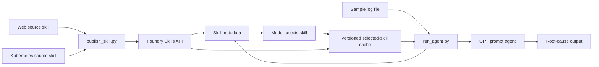

# Foundry Skills — Log Root-Cause Analysis Demo

A Microsoft Foundry **prompt agent** demo that analyzes logs and returns a probable
**root cause** plus a **suggested solution**. The agent is powered by a GPT model
deployment (default `gpt-5.4`, version `2026-03-05`, region `eastus2`) and uses the
Microsoft Foundry Skills **direct download** pattern: publish web and Kubernetes
`SKILL.md` files as versioned Foundry skills, read Foundry skill metadata at run
time, let the model select the best skill, download the selected active version
when its versioned cache is missing, then inject only that selected `SKILL.md`
into the prompt agent instructions. The demo includes reproducible sample logs,
with an optional generator for creating fresh log data.

> **Preview notice:** Microsoft Foundry Skills and the related
> `azure-ai-projects` `project.beta.skills` APIs are in preview. SDK method names,
> request shapes, model behavior, or service requirements may change, and this
> demo code may need updates as the preview evolves. See
> [Use skills with Microsoft Foundry agents (preview)](https://learn.microsoft.com/en-us/azure/foundry/agents/how-to/tools/skills?pivots=python)
> for the official guidance.

## Architecture

Included sample logs are passed to `run_agent.py`. The runner reads configured
Foundry skill metadata, asks the model to choose one skill from names and
descriptions, reuses the selected skill from the versioned local cache when
available, downloads it from Foundry when missing, and invokes the GPT prompt
agent with only that selected `SKILL.md`.



ASCII fallback:

```
source/skills/*.md ──▶ publish_skill.py ──▶ Foundry skills metadata ──▶ model selects one skill
sample_logs/*.log ───────────────────────▶ run_agent.py ──▶ skills/<name>/<version>/SKILL.md cache ──▶ root-cause output
```

## Project Structure

```
foundry-skills/
├── README.md
├── azure.yaml                  # azd deployment entry point
├── requirements.txt
├── .env.example
├── infra/                      # Bicep + provisioning for the Foundry project
│   ├── main.bicep
│   ├── main.bicepparam
│   └── provision.sh            # Azure CLI fallback if not using azd
├── source/
│   └── skills/                 # Authored SKILL.md files published to Foundry
│       ├── web-logs-analysis/
│       │   └── SKILL.md
│       └── k8s-logs-analysis/
│           └── SKILL.md
├── skills/                     # Downloaded active Foundry skill cache
│   ├── web-logs-analysis/
│   │   └── v1/
│   │       └── SKILL.md
│   └── k8s-logs-analysis/
│       └── v1/
│           └── SKILL.md
├── src/
│   ├── log_generator/          # Generates realistic sample logs
│   ├── skills/                 # Publishes/downloads Foundry Skills
│   └── agent/
│       └── run_agent.py        # Runs the prompt agent against a log file
└── sample_logs/                # Generated sample logs (committed for offline demo)
    └── web.log
```

## Prerequisites

- An **Azure subscription**
- **Azure CLI** (`az`) — logged in via `az login`
- **Azure Developer CLI** (`azd`) for provisioning with `azd up`
- **Python 3.x**
- **uv** for creating the local Python virtual environment
- `azure-ai-projects >= 2.2.0` for the preview `project.beta.skills` APIs
- A **Microsoft Foundry project** provisioned by `azd up` or `infra/provision.sh`
- The **Foundry User** role on the Foundry project for Skills API and agent calls

> Region: **eastus2** &nbsp;•&nbsp; Default model: **gpt-5.4** (`2026-03-05`)

See the Appendix for model override commands, resource naming details, and Foundry
Skills preview SDK notes.

## Getting Started

Follow these steps from the repository root to provision Azure resources, publish the
Foundry Skills, and run the agent against the included sample logs.

1. **Create a Python virtual environment and install dependencies**:

   ```bash
   uv venv .venv
   source .venv/bin/activate
   uv pip install -r requirements.txt
   ```

2. **Sign in with Azure Developer CLI**:

   ```bash
   azd auth login
   ```

3. **Create an azd environment and choose a location**:

   ```bash
   azd env new
   ```

   Choose a short lowercase environment name such as `foundry-skills-demo` and
   select **East US 2** (`eastus2`) for the location.

4. **Provision the Foundry project and GPT model deployment**:

   ```bash
   azd up
   ```

   This deploys the Bicep infrastructure in [infra/main.bicep](infra/main.bicep):
   an Azure AI Services account, a Foundry project, and a GPT model
   deployment in the location you selected. Use `eastus2` unless you intentionally
   change the demo region. See the Appendix for naming details.

5. **Publish the local `SKILL.md` files as versioned Foundry Skills**:

   ```bash
   python -m src.skills.publish_skill
   ```

   This publishes both authored skills from `SOURCE_SKILL_PATHS`:
   - [`source/skills/web-logs-analysis/SKILL.md`](source/skills/web-logs-analysis/SKILL.md) for web/API logs
   - [`source/skills/k8s-logs-analysis/SKILL.md`](source/skills/k8s-logs-analysis/SKILL.md) for Kubernetes/container logs

   To publish only one source skill, pass `--skill source/skills/web-logs-analysis/SKILL.md` or
   `--skill source/skills/k8s-logs-analysis/SKILL.md`.

6. **Run the agent against a sample log**:

   ```bash
   python -m src.agent.run_agent --log sample_logs/web.log
   ```

   The runner first reads Foundry skill metadata with `project.beta.skills.get(...)`,
   asks the model to choose one skill from names/descriptions only, downloads the
   active version of that selected skill when the versioned local cache is missing,
   and then creates the prompt agent with only that downloaded `SKILL.md`. The
   response includes a `Selected Skill` section to show which skill was used for
   the input log.

7. **Try the other planted scenarios**:

   ```bash
   python -m src.agent.run_agent --log sample_logs/k8s.log
   python -m src.agent.run_agent --log sample_logs/mixed.log
   ```

## How the Skill Works

The agent's reasoning is driven by Skills defined in
[`source/skills/web-logs-analysis/SKILL.md`](source/skills/web-logs-analysis/SKILL.md) and
[`source/skills/k8s-logs-analysis/SKILL.md`](source/skills/k8s-logs-analysis/SKILL.md). In this
direct-download mode, the skills are first stored centrally in Foundry through the
Skills API. At run time, `run_agent.py` gets the configured skill metadata from
Foundry, routes the log to one skill using only the skill names and descriptions,
downloads the active version of that selected skill into
`skills/<skill-name>/<default-version>/`, and injects only that downloaded
`SKILL.md` into the prompt agent's instructions for the analysis session.

If the selected skill's active Foundry default version is already downloaded, the
runner reuses `skills/<skill-name>/<default-version>/SKILL.md`.

That means the demo exercises the Foundry Skills lifecycle enough to show the value of
versioned behavior: update a `SKILL.md`, publish a new Foundry skill version,
download the active version, and rerun the agent without changing the agent code.

## Appendix

### Azure Resource Naming

The azd environment name is exposed as `AZURE_ENV_NAME`. The [azure.yaml](azure.yaml)
pre-provision hook sets the resource group name to `rg-<env name>`. For example,
environment `foundry-skills-demo` deploys to `rg-foundry-skills-demo`.

Foundry resources also derive from the environment name:

- Foundry account: `aif-<env name>-<4-char suffix>`
- Foundry project: `aif-proj`

For example, environment `foundry-skills-demo` creates a Foundry account like
`aif-foundry-skills-demo-ab12` and project `aif-proj`.

### azd Outputs

The [infra/main.bicep](infra/main.bicep) deployment exports the values the Python
scripts read, including:

- `FOUNDRY_PROJECT_ENDPOINT`
- `AZURE_AI_PROJECT_ENDPOINT`
- `MODEL_DEPLOYMENT_NAME`
- `AZURE_REGION`
- `FOUNDRY_SKILL_NAMES`
- `SOURCE_SKILL_PATHS`
- `AGENT_NAME`

### Refresh `.env` Manually

`azd up` runs [infra/post-provision.sh](infra/post-provision.sh), which writes the
latest azd outputs into `.env` automatically. If you need to refresh `.env`
manually, run:

```bash
azd env get-values > .env
```

Prefer Azure CLI instead of azd? Run `./infra/provision.sh` and copy the printed
values into `.env`.

### Verify the Foundry SDK Version

The demo expects `azure-ai-projects` 2.2.0 or later for the preview
`project.beta.skills` APIs. To verify the installed version:

```bash
python - <<'PY'
import azure.ai.projects as projects
print(projects.__version__)
PY
```

### Generate New Sample Logs

The demo includes prebuilt logs under `sample_logs/`, so this step is optional.
To regenerate deterministic sample logs, run:

```bash
python -m src.log_generator.generate --scenario all --seed 42 --out sample_logs
```

This writes `sample_logs/web.log`, `sample_logs/k8s.log`, `sample_logs/mixed.log`,
and matching `.expected.json` ground-truth files.

### Download Skills Manually

The normal `run_agent.py` flow reads Foundry skill metadata, selects one skill, and
downloads only the selected active version automatically. To download all configured
skills into the local cache for inspection, run:

```bash
python -m src.skills.download_skill
```

The downloaded packages are written to `skills/<skill-name>/SKILL.md` for manual
inspection. The normal runner uses versioned cache folders under
`skills/<skill-name>/<default-version>/`.

### Model Version Notes

The default deployment is `gpt-5.4` in `eastus2` with model version `2026-03-05`.

To list available model names and versions for a region:

```bash
az cognitiveservices model list \
   --location eastus2 \
   --query "[].{name:model.name, version:model.version, format:model.format, default:model.isDefaultVersion}" \
   -o table
```

To override the model deployment values before running `azd up`:

```bash
azd env set MODEL_DEPLOYMENT_NAME <model-name>
azd env set AZURE_AI_MODEL_NAME <model-name>
azd env set AZURE_AI_MODEL_VERSION <model-version>
```

For `gpt-5.4` in East US 2:

```bash
azd env set MODEL_DEPLOYMENT_NAME gpt-5.4
azd env set AZURE_AI_MODEL_NAME gpt-5.4
azd env set AZURE_AI_MODEL_VERSION 2026-03-05
```

If deployment fails in another subscription or region, query the catalog with:

```bash
az cognitiveservices model list \
   --location eastus2 \
   --query "[?model.name=='gpt-5.4']"
```

### Foundry Skills SDK Notes

The Foundry Skills APIs used by this demo are preview APIs. Reference:
[Use skills with Microsoft Foundry agents (preview)](https://learn.microsoft.com/en-us/azure/foundry/agents/how-to/tools/skills?pivots=python)

The code creates the project client with preview APIs enabled:

```python
AIProjectClient(..., allow_preview=True)
```

The demo expects `azure-ai-projects` 2.2.0 or later, including these preview APIs:

- `project.beta.skills.create`
- `project.beta.skills.get`
- `project.beta.skills.list`
- `project.beta.skills.download`
- `project.beta.skills.create_from_files`

Publishing uses inline skill content with `SkillInlineContent`; the normal runner
downloads the active Foundry skill package into
`skills/<skill-name>/<default-version>/SKILL.md`.
